# Aurora - Assistente Virtual da +A Educação
Este é um assistente virtual desenvolvido para ajudar nos estudos com informações sobre programação, utilizando GPT-3.5-16k, GPT-4 multimodal, Amazon Transcribe e RAG para utilizar documentos como referencia para responder o usuario. A seguir, você encontrará informações detalhadas sobre como executar e interagir com este assistente.

## Aviso
Vale ressaltar que, os dados indexados uytilizados para buscar o contexto possui poucas informações, no geral apenas sobre html. Recomendo que para ter uma experiencia melhor selecione a opção "usar todo poder da aurora", mas caso queira limitar o contexto do chatbot apenas aos documentos indexados para pesquisa selecione a opção "usar apenas os dados da +A Educação". Mais abaixo explico melhor sobre essas duas opções.

## Stack
- Python
- Langchain
- Microsoft Azure -> (GPT-3.5-16, text-embedding-ada-002)
- AWS -> (Lambda Function, S3, CloudWatch, IAM, Amazon Transcribe, Layers, SAM)
- Pinecone -> Semantic Search
- MongoDB -> Query Search
- GPT4 -> Multimodal

## Funcionalidades

### Iniciar nova conversa.
- Ao iniciar uma nova conversa é gerado um id único que é usado como chave primaria para armazenar as conversas em um mongoDB.

### Usar exemplos de mensagens pré-definidas.
São utilizados 3 exemplos para demonstrar ao usuario maneiras de interagir com a Aurora.
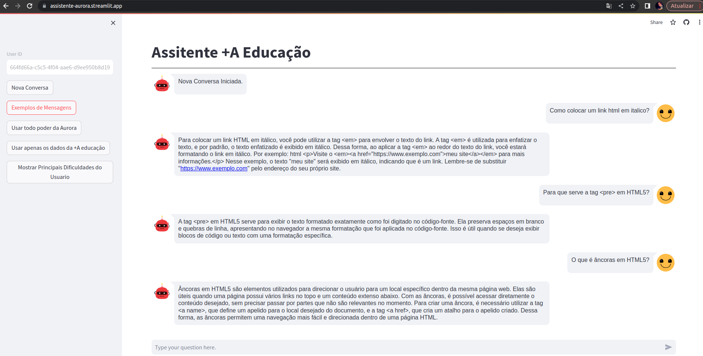
```
"Como colocar um link html em italico?"
"Para que serve a tag <pre> em HTML5?"
"O que é âncoras em HTML5?"
```

### Alternar entre diferentes fontes de conhecimento (Aurora e +A Educação).
- É possivel usar o chatbot usando apenas as informações nos dados indexados para pesquisa diponibilizado pela +A Educação ou usar todo poder da Aurora que busca informações além dos dados indexados para responder as duvidas dos usuarios.
- Toda vez que utilizar a opção "Usar apenas os dados da +A educação" vai ser iniciado uma nova conversa usando apenas os dados disponibilizados pela +A Educação.
- Toda vez que utilizar a opção "Usar todo poder da Aurora" vai continuar o historico da conversa anterior mas vai utilizar mais informações que os conteudos utilizados pela A+ Educação.
- Para iniciar uma nova conversa utilizando todo poder da aurora é só clicar em uma "Nova Conversa" e "Usar todo poder da Aurora".

### Identificar as principais dificuldades do usuário com base no histórico de mensagens.
Ao interagir com a Aurora é possivel gerar insights para entender os temas mais conversados. Com isso é possivel enviar conteudos customizados para cada usuario.
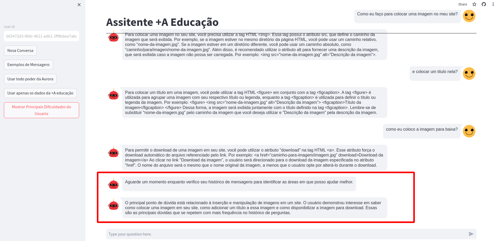

## Arquitetura

A decisão da arquitetura foi tomada após considerar diversos fatores, incluindo a escalabilidade, a manutenibilidade e a performance do sistema. Vale ressaltar que é possivel usar os serviços de armazenamento do Azure para diminuir a complexidade da quantidade de ferramentas, dessa forma podemos utilizar o CosmoDB como alternativa para salvar o historico de conversa (MongoDB Cloud) e os vetores (Pinecone). Além disso, é possivel utilizar serviços de serverless do Azure como alternativa para o AWS Lambda Functions.


### Service 1 - Front-end
Foi utilizado o Streamlit para disponibilizar a aplicação.
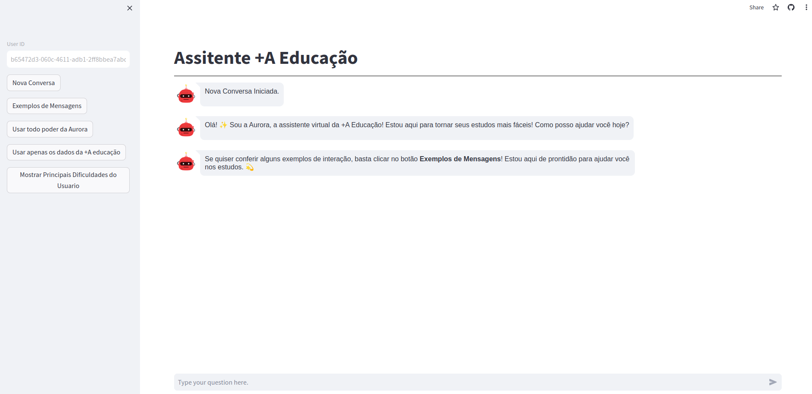

### Service 2 - Back-end
- Esse serviço está disponibilizado por meio de uma lambda function.
- Cria os vector embedding das mensagens do usuario.
- Consultar no Mongo para buscar o historico de conversa.
- Consultar no Pinecone para buscar o dados utilizados para contexto.
- Logica de prompts.
- Prompts de segurança para evitar injeção de prompt e mensagens muito grandes.
- Prompts para classificar a intenção do usuario.
- Prompt para melhorar a pesquisa semantica.
- Gerenciamento de fluxo de dialogo.
- Utilização do KNN para carregar os melhores exemplos nos prompts de fora do escopo e injeção de prompt.

Testes de integração.
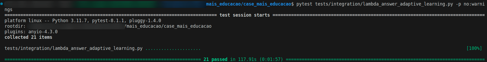

### Service 3 - MongoDB
Foi utilizando o MongoDB para armazenar as conversas entre o usuario e o assitente para possibilitar a utilização do historico de conversa ao montar os prompts.

Exemplo de conversa com exemplo de historica:
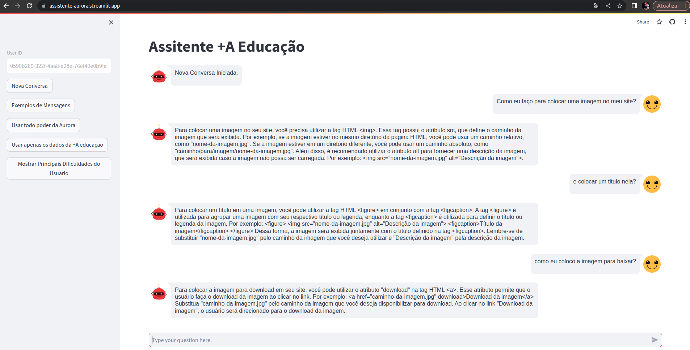

Collection MongoDB
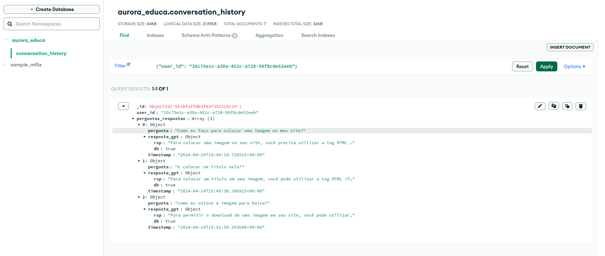

### Service 4 - GPT-3.5
Foi utilizado o modelo GPT-3.5-16k fornecido pela plataforma Microsoft Azure para alimentar nosso sistema. A comunicação é estabelecida através do LangChain, por meio de chamada callback para facilitar a interação entre os componentes do sistema.

### Service 5 - Pinecone
Pinecone armazena as informações utilizadas para o contexto dos prompts. Os dados armazenados no Pinecone incluem o vetor de embedding, o nome do arquivo e o texto que foi vetorizado.

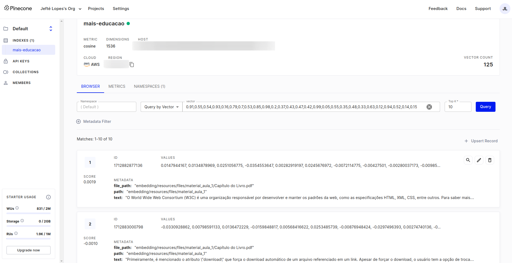

### Service 6 - Back-end
Esse serviço é reponsavel pela logica de criação dos embeddings utilizando o text-embedding-ada-002 para criar os vetores. 
Para cada tipo de arquivo existe uma forma unica de ser vetorizada, variando de tamanho de chunk e utilização de sumarização.
Inicialmente, executei o serviço em minha máquina local, mas é viável utilizar qualquer serviço de computação em nuvem para executá-lo.


## Pré-requisitos e Dependências

Para executar este projeto é necessário ter o Python instalado em sua máquina. Além disso, é recomendável configurar um ambiente virtual para isolar as dependências.

- libs tests/debug -> pytest==8.1.1 || virtualenv==20.0.17 || python-dotenv==1.0.0

- libs lambdas -> openai==1.16.2 || docarray==0.40.0 || langchain==0.1.14 || langchain-community==0.0.32 || regex==2023.12.25 || requests==2.31.0 || pandas==2.2.1 || pinecone-client==3.2.2 || tabulate==0.9.0 || tiktoken==0.6.0 || jsonschema==4.17.3 || pymongo==4.6.3

- libs embedding -> langchain==0.1.14 || python-dotenv==1.0.0 || virtualenv==20.0.17 || PyYAML==6.0.1 || Unidecode==1.3.8 || python-dateutil==2.8.2 || pypdf==4.1.0 || jsonschema==4.17.3 || langchain-openai==0.1.1 || pinecone-client==3.2.2 || jq==1.7.0

## Melhorias
Ponto de melhoria 1:
- Toda construção de um agente conversacional requer duas bases fundamentais: compreender o que está sendo solicitado, seja por meio de classificação de intenção, extração de entidade ou palavras-chave, e necessita de um gerenciamento de diálogo.
Começaria utilizando uma plataforma ou framework para trabalhar com o fluxo conversacional. Desta forma, toda jornada de conversa seria guiada por um gerenciamento de diálogo, possibilitando cenários de conversas mais fluidas. O Rasa Open Source, por exemplo, é um bom framework para construir chatbots e utilizaria-o para gerenciar o diálogo conforme a compreensão da solicitação do usuário. Em casos de FAQ, quando identificada uma dúvida, é possível por meio do gerenciamento de diálogo fazer uma requisição para o GPT e retornar a resposta ao usuário, com toda a conversa sendo gerenciada pelo Rasa para manter o contexto da conversa. O Rasa foi um exemplo, mas é possível utilizar qualquer ferramenta para isso, como Dialogflow, Watson, Blip, entre outros.

Ponto de melhoria 2:
- Testar outros LLMs para avaliar os resultados, como Claude (Anthropic), Ministral AI, Llama2, Gemini.

Ponto de melhoria 3:
- Continuar utilizando Serverless, mas implementando com imagens Docker para melhor gerenciamento.

Ponto de melhoria 4:
- Aprimorar a estrutura do código para definir com mais clareza as responsabilidades de cada parte do código.

Ponto de melhoria 5:
- Refinar os prompts para obter resultados mais precisos.

Ponto de melhoria 6:
- Melhorar os testes de integração e criar os testes unitarios.

Ponto de melhoria 7:
- Melhorar o retorno das repostas com codigo para facilitar a compreensão

Ponto de melhoria 8:
- Adicionar Logger

## Requisitos não entregue
- Não foi possível implementar o requisito de identificar a melhor forma de responder ao usuário. Pensei em uma solução em que a resposta textual é sempre enviada. No entanto, a resposta pode ser complementada com botões (Vídeo, Áudio, Imagem) caso o usuário prefira um formato diferente.

- Desenvolvi um prompt para identificar o principal ponto de dúvida do usuário com base na análise de todo o histórico de perguntas armazenadas no MongoDB. No entanto, ainda não criei uma funcionalidade para gerar conteúdo com base nos pontos de dúvida identificados. Consigo criar uma lógica onde utilizo um prompt para sintetizar os principais pontos de dúvida em palavras-chave e realizar uma busca semântica nos arquivos. Isso me permitiria enviar mensagens de forma ativa com conteúdos que possam ajudar o usuário, seja o próprio arquivo ou uma sumarização para retorno ao usuário. Essa funcionalidade pode ser utilizada para recomendar conteúdos de estudo.

## Imagens de conversas

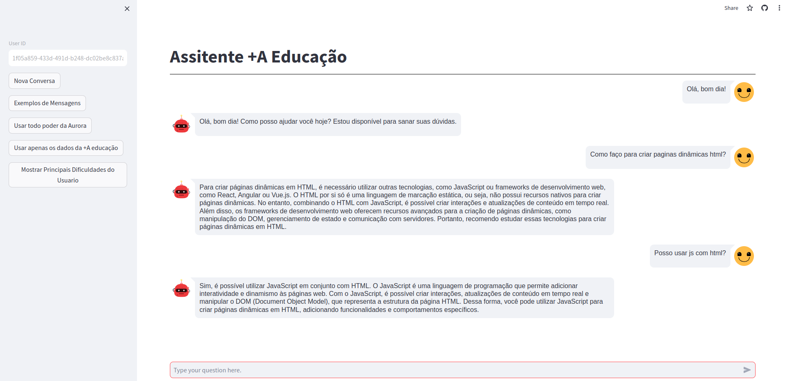
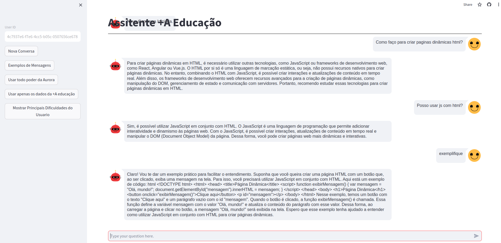

### Exemplo de conversa em que é feita a transição do "assistente +A Educação" para "todo poder da Aurora"
Exemplo de conversa usando os dados da +A Educação:
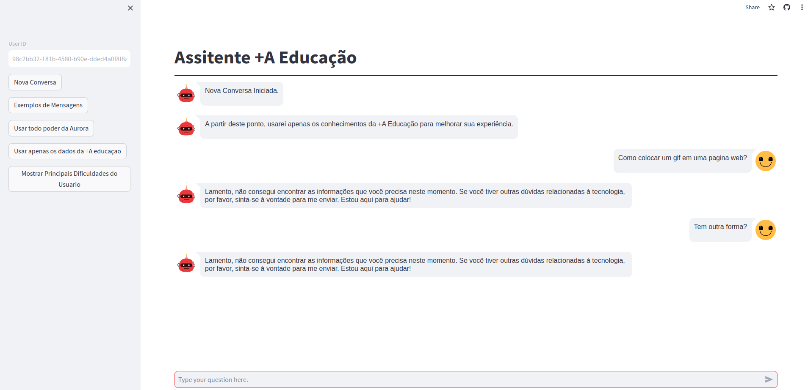

Exemplo de conversa usando todo poder da Aurora:
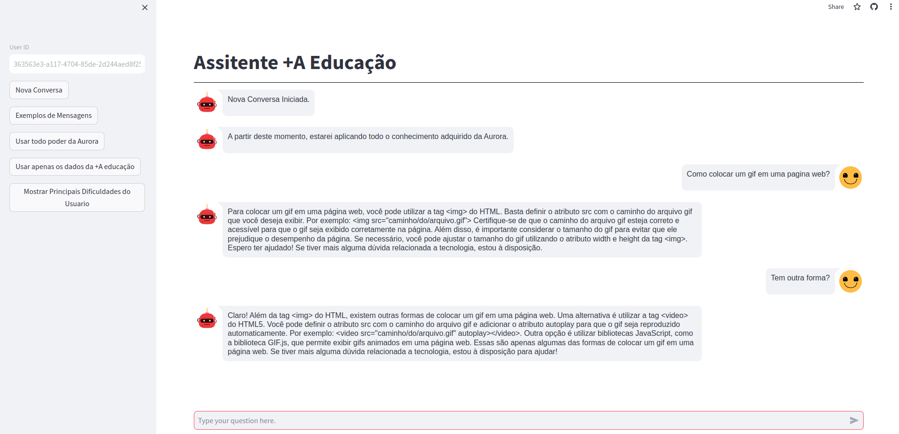
